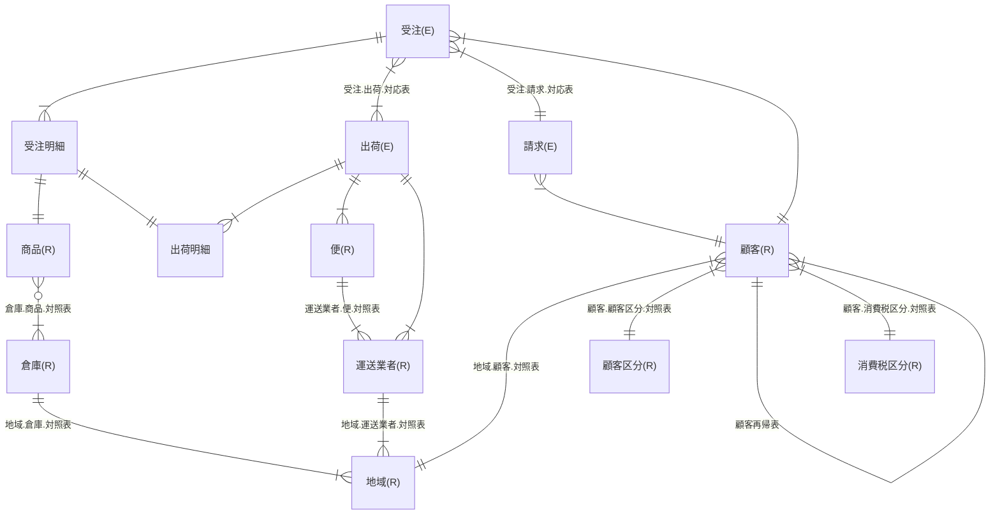

```mermaid
erDiagram
    "受注(E)" ||--|{ "受注明細" : ""
    "受注明細" ||--|| "商品(R)" : ""
    "出荷(E)" ||--|{ "出荷明細" : ""
    "受注明細" ||--|| "出荷明細" : ""
    "受注(E)" }|--|{ "出荷(E)" : "受注.出荷.対応表"
    "受注(E)" }|--|| "請求(E)" : "受注.請求.対応表"
    "受注(E)" }|--|| "顧客(R)" : ""
    "出荷(E)" ||--|{ "便(R)" : ""
    "出荷(E)" ||--|{ "運送業者(R)" : ""
    "請求(E)" }|--|| "顧客(R)" : ""
    "顧客(R)" }|--|| "地域(R)" : "地域.顧客.対照表"
    "倉庫(R)" ||--|{ "地域(R)" : "地域.倉庫.対照表"
    "運送業者(R)" ||--|{ "地域(R)" : "地域.運送業者.対照表"
    "便(R)" ||--|{ "運送業者(R)" : "運送業者.便.対照表"
    "顧客(R)" }|--|| "顧客区分(R)" : "顧客.顧客区分.対照表"
    "顧客(R)" ||--|{ "顧客(R)" : "顧客再帰表"
    "顧客(R)" }|--|| "消費税区分(R)" : "顧客.消費税区分.対照表"
    "商品(R)" }o--|{ "倉庫(R)" : "倉庫.商品.対照表"
    
```